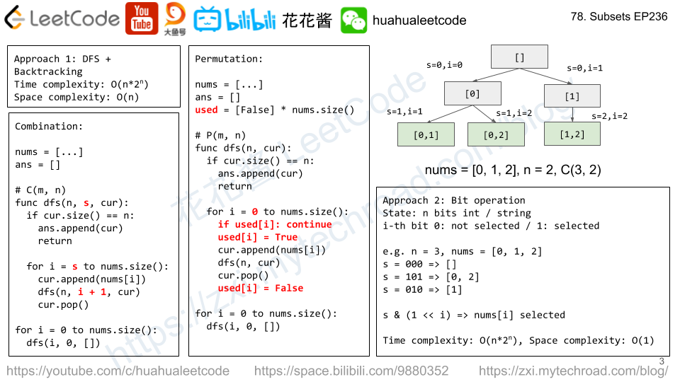

# DFS

## Recursion

Function calls itself

* 使用递归条件判断
  1. 子问题须与原始问题为同样的事,且更为简单;
  2. 不能无限制地调用本身,须有个出口,化简为非递归状况处理。
* 写递归函数的时候递归函数体要考虑在这一点/一层/一块根据不同情况要做的事和等下一点/一层/一块递归完毕回来时当前点和递归回来的点之间的关系

### Time & Space Complexity

Space complexity is the maximum call stack of the recursion

### When to use DFS

* Find all possible solutions
* 90% of the questions are permutations and combinations

### 3 Elements of recursion

* 递归的定义
* 递归的拆解
* 递归的出口

### Combination \(组合\)

* Find all combinations that meets the requirements
* Key to determine this is a combination problem
  * All elements in combinations are in-ordered \(组合中元素是顺序无关的\)
  * Time Complexity
    * 2^n related

### Permutations \(排列\)

* Key to determine this is a permutation problem
  * Orders of appearance masters
  * Time Complexity
    * n! related

 

## Problems

* [Nested List Weight Sum II](../../leetcode-problems/364.-nested-list-weight-sum-ii.md)
* [Max Area of Island](../../leetcode-problems/695.-max-area-of-island.md)
* [All Nodes Distance K in Binary Tree](../../leetcode-problems/863.-all-nodes-distance-k-in-binary-tree.md)
* [Palindrome Partitioning](../../leetcode-problems/131.-palindrome-partitioning.md)
* [Validate Binary Search Tree](../../leetcode-problems/98.-validate-binary-search-tree.md)
* [979. Distribute Coins in Binary Tree](https://app.gitbook.com/@ericwei0910/s/workspace/~/edit/drafts/-LpfeWEe4WYnAMdRR_lB/leetcode-problems/979.-distribute-coins-in-binary-tree)
* [106. Construct Binary Tree from Inorder and Postorder Traversal](https://app.gitbook.com/@ericwei0910/s/workspace/~/edit/drafts/-LpfeWEe4WYnAMdRR_lB/leetcode-problems/106.-construct-binary-tree-from-inorder-and-postorder-traversal)

