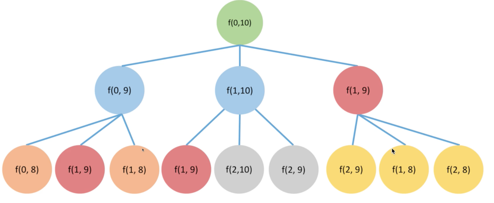

# Intervals

Usually given a sequence, ask certain characteristics of it. The optimal result is a sequence \[i, j\]. And it contains **single interval** and **double intervals** DP.

### Memorization Search

* Usually the dynamic programming approach is bottom up which starts from single item to larger dataset
* But it can also be solved sometime using top-down memorization search
  * Memorization search starts from top and follows a top-down recursion approach

### Double Intervals

#### Solution

* If Last elements of both sequence match with each other
* If the calculation needs the last element
* Reduce the scale of the original problem

#### State

* dp\[i\]\[j\] denotes 
  * 0 ~ i-th element of A interval and,
  * 0 ~ i-th element of B interval

