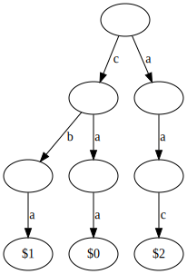
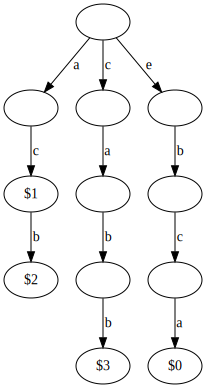

# 336. Palindrome Pairs

> Given a list of **unique** words, find all pairs of **distinct** indices `(i, j)` in the given list, so that the concatenation of the two words, i.e. `words[i] + words[j]` is a palindrome.

**Example 1:**

```text
Input: ["abcd","dcba","lls","s","sssll"]
Output: [[0,1],[1,0],[3,2],[2,4]] 
Explanation: The palindromes are ["dcbaabcd","abcddcba","slls","llssssll"]
```

**Example 2:**

```text
Input: ["bat","tab","cat"]
Output: [[0,1],[1,0]] 
Explanation: The palindromes are ["battab","tabbat"]
```

## Approach \#1 Trie

### The Brute Force Solution <a id="the-brute-force-solution"></a>

The brute force solution is pretty straightforward. We check each pair of words to see if they form a palindrome, if they do, then we add them to the output. The code in python \(// is integer divide in python\):

```python
# word - string
# This function takes a string and returns true iff it's a palindrome.
def isPalindrome(word):
    for i in range(len(word) // 2):
        if word[i] != word[-1 - i]:
            return False
    return True

# words - [string]
# This function takes a list of words and solves the palindrome pairs problem.
def palindromePairs(words):
    output = []
    for i, word1 in enumerate(words):
        for j, word2 in enumerate(words):
            # Words aren't allowed to pair with themselves.
            if (i == j):
                continue
            if isPalindrome(word1 + word2):
                output.append([i, j])
    return output
```

One note about the isPalindrome function:

A naive implementation of isPalindrome is just string == reversed\_string. If we let n be the length of the string, it does n equality checks instead of the n/2 equality checks that the implementation above does. This isn’t that important in practice, but another simple interview problem is just, “Write a function that checks if a string is a palindrome.” It’s good to know how to make the best version in case you are asked that question.

Another thing to note about this version of isPalindrome is that it can be derived from a recursive definition of a palindrome. Thinking in terms of this recursive definition can make some interview problems about palindromes easier.

**Recursive definition of palindrome:**

A palindrome is either:

1. An empty string \(base case 1\)
2. A single character \(base case 2\)
3. xyx where y is a palindrome and x is a single character.

If we use this definition to write isPalindrome we get:

```text
def isPalindrome(word):
    if len(word) == 0 or len(word) == 1:
        return true
    return word[0] == word[-1] and isPalindrome(word[1:-1])
```

If we analyze what that function is doing and write an iterative version, we’ll arrive at the function above.

### Improving the Brute Force <a id="improving-the-brute-force"></a>

The brute force is O\(k n^2\) where k is the length of the largest word in the input wordlist and n is the number of words in the wordlist.

Can we do better? In the worst case, all pairs make a palindrome \(say an input of “a”, “aa”, “aaa”, “aaaa”, …\), the output will have n^2 elements and we’ll have to take O\(k n^2\) time to create the outputs, so in these cases we can’t do better. What if we make some reasonable assumptions about the input:

1. Each word only makes a palindrome with a small portion of the list.
2. The number of words is much larger than the size of any word \(n » k\).

In this case, can we improve the brute force?

#### Solution 1 - Trie <a id="solution-1---trie"></a>

In the brute force, we compare each word against each other word, can we somehow look at fewer?

Let’s say we are considering two words: A, B. AB could only be a palindrome if A\[0\] == B\[-1\] \(the last letter of B = the first letter of A\). What if we had a map: last letter -&gt; \(all words with that last letter\)? Then, we could quickly narrow our search to a smaller subset of the entire wordlist. That’s good, but why not apply the same idea again? AB can only be a palindrome if A\[1\] == B\[-2\] \(the second letter of A = the second last letter of B\), so what if we have another hash table to help us narrow down the words again?

If we keep applying this idea, we end up with a trie.

Imagine we have a trie that:

* Is built with each input word in reverse.
* Has the index of each word in the input array as the ‘end’ indicator.

For example, if the words were “aac”, “abc”, “caa”, then the trie would look like this:



Let’s suppose we’re trying to find all words that can match an input word, A. We have two cases:

1. The matching word is shorter than or the same size as A
2. The matching word is longer than A

To find words in case 1, we can walk through our trie using the letters in A, everytime we encounter a word ending, we can check the ‘rest’ of the letters in A to see if they form a palindrome. If they do, then AB forms a palindrome. For example, suppose the word list is, \[“acbe”, “ca”, “bca”, “bbac”\].

The trie would look like this:



We’ll search for words that form a palindrome when appended to “acbe”.

We go down the trie, first limiting ourselves to all words that end with ‘a’, then limiting ourselves further to all words that have second last character = ‘c’, then encountering the end word indicator that indicates “ca” is a word. Now, we check if “be” \(acbe - ac\) forms a palindrome, since it doesn’t we move on.

We continue down the trie looking for words whose 3rd last character is ‘b’, and we encounter the end word indicator showing that “bca” is a word. Now, we check if “e” is a palindrome, since it is, we know acbebca is a palindrome, and we output it.

To find words in case 2, we need to also check for palindromes below the node that the word we’re searching with ends on. Imagine searching for words that form a palindrome when appended to “ca”.

We walk down the trie along the ‘a’, ‘c’, path ending up on the node labeled $1.

Any word endings below the current node indicate words of the form: ca \_\_\_ ac. So, if any of these have a palindrome in the blank space, then they can be concatenated to “ac” to form a palindrome. We need to search for any word ending below the current node that are palindromes from the current node down.

Rather than searching for every query, we can create the list of all palindromes below the current node as we build the trie \(while adding, if the rest of the letters in the word form a palindrome, add it to a list of all “palindromes below this node” stored in the node\).

```python
class Trie:
    def __init__(self):
        # letter -> next trie node.
        self.paths = collections.defaultdict(Trie)
        # If a word ends at this node, then this will be a positive value
        # that indicates the location of the word in the input list.
        self.wordEndIndex = -1
        # Stores all words that are palindromes from this node to end of word.
        # e.g. if we are on a path 'a','c' and word "babca" exists in this trie
        # (words are added in reverse), then "acbab"'s index will be in this
        # list since "bab" is a palindrome.
        self.palindromesBelow = []

    # Adds a word to the trie - the word will be added in 
    # reverse (e.g. adding abcd adds the path d,c,b,a,$index) to the trie.
    # word - string the word to be added
    # index - int index of the word in the list, used as word identifier.
    def addWord(self, word, index):
        trie = self
        for j, char in enumerate(reversed(word)): 
            if isPalindrome(word[0:len(word)-j]):
                trie.palindromesBelow.append(index)
            trie = trie.paths[char]
        trie.wordEndIndex = index
        
def isPalindrome(word):
    for i in range(len(word) // 2):
        if word[i] != word[-1 - i]:
            return False
    return True

def makeTrie(words):
    trie = Trie()
    for i, word in enumerate(words):
        trie.addWord(word, i)
    return trie

def getPalindromesForWord(trie, word, index):
    # Walk trie. Every time we find a word ending,
    # we need to check if we could make a palindrome.
    # Once we get to the end of the word, we must check
    # all endings below for palindromes (they are already
    # stored in 'palindromesBelow').
    output = []
    while word:
        if trie.wordEndIndex >= 0:
            if isPalindrome(word):
                output.append(trie.wordEndIndex)
        if not word[0] in trie.paths:
            return output
        trie = trie.paths[word[0]]
        word = word[1:]

    if trie.wordEndIndex >= 0:
        output.append(trie.wordEndIndex)
    output.extend(trie.palindromesBelow)
    return output

class Solution:
    def palindromePairs(self, words: List[str]) -> List[List[int]]:
        trie = makeTrie(words)
        output = []
        for i, word in enumerate(words):
            candidates = getPalindromesForWord(trie, word, i)
            output.extend([[i, c] for c in candidates if i != c])
        return output
```

## Approach \#2 Non Trie, Palindrome

In the last solution, we ended up splitting the palindrome pairs into two cases:

1. Where the word being appended to was shorter or the same length
2. Where the word being appended was longer.

If we use this idea, we can solve the problem without ever building a trie.

For each word, A, we’ll find:

1. All words, B, such that BA forms a palindrome and B is shorter than or the same length as A
2. All words, B, such that AB forms a palindrome and B is shorter than A

If we do this for all words, we’ll find all palindrome pairs.

Let’s examine case 1:

We have a word A and want all shorter words, B, that form a palindrome when prepended to form BA:

we would need something of the form: xyx’ where x’ is x reversed \(e.g. abc\_\_\_\_cba where the blank is a palindrome\).

If we create a hashtable of the words to get O\(1\) lookup, we can find all of these in k^2 time by considering each possible value for x.

```python
def isPalindrome(word):
    return word == word[::-1]

class Solution:
    def palindromePairs(self, words: List[str]) -> List[List[int]]:
        output = []
        word_to_index = {word: i for i, word in enumerate(words)}
        for i, word1 in enumerate(words):
            for j in range(len(word1)+1):
                # Case 1 - Find all words, B, shorter than or the same size as
                # word1, that can be prepended so B + word1 is a palindrome.
                x_reversed = word1[j:][::-1]
                rest = word1[0:j]
                if isPalindrome(rest) and x_reversed in word_to_index and word_to_index[x_reversed] != i:
                    output.append([word_to_index[x_reversed], i])
                # Case 2 - Find all words, B, shorter than word1 that can be appended
                # so word1 + B is a palindrome.
                if j == len(word1): continue
                x_reversed = word1[:j][::-1] 
                rest = word1[j:]
                if isPalindrome(rest) and x_reversed in word_to_index and word_to_index[x_reversed] != i:
                    output.append([i, word_to_index[x_reversed]])
        return output
```

