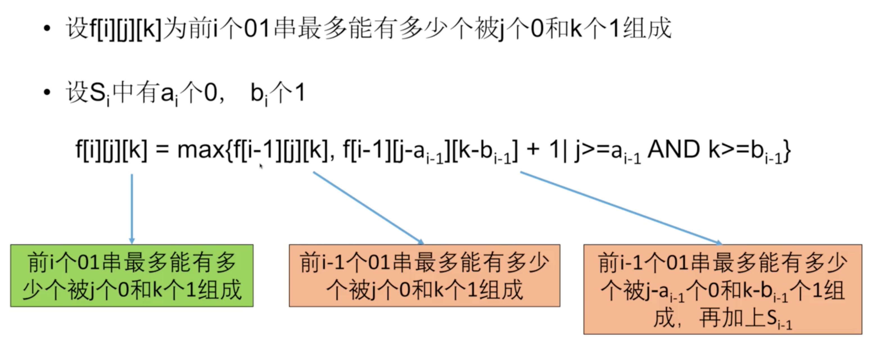

# 474. Ones and Zeroes

> In the computer world, use restricted resource you have to generate maximum benefit is what we always want to pursue.
>
> For now, suppose you are a dominator of **m** `0s` and **n** `1s` respectively. On the other hand, there is an array with strings consisting of only `0s` and `1s`.
>
> Now your task is to find the maximum number of strings that you can form with given **m** `0s` and **n** `1s`. Each `0` and `1` can be used at most **once**.
>
> **Note:**
>
> 1. The given numbers of `0s` and `1s` will both not exceed `100`
> 2. The size of given string array won't exceed `600`.
>
> **Example 1:**
>
> ```text
> Input: Array = {"10", "0001", "111001", "1", "0"}, m = 5, n = 3
> Output: 4
>
> Explanation: This are totally 4 strings can be formed by the using of 5 0s and 3 1s, which are “10,”0001”,”1”,”0”
> ```
>
> **Example 2:**
>
> ```text
> Input: Array = {"10", "0", "1"}, m = 1, n = 1
> Output: 2
>
> Explanation: You could form "10", but then you'd have nothing left. Better form "0" and "1".
> ```

## Solutions

Starts from last step, for optimal solution, if it contains last S\(t-1\).

#### Case 1

if it does not contain S\(t-1\), then we need to know within T-1 strings, use m's 0 and n's 1 can get how many 01 strings

#### Case 2

If it contains S\(t-1\), then let's say T-1 01 strings contains a\(t-1\) 0s, and b\(t-1\) 1s. We need to know that use m-a\(t-1\) 0s and n-b\(t-1\) 1s, how many 01 strings can we get from 0 ~ T-1 01 strings

#### Subproblem

How to record changes of numbers of 0s and 1s?

* put it in state
* dp\[i\]\[j\]\[k\] denotes for 0 ~ i-th 01 strings, at most how many of them can be formed using j 0s and k 1s.

#### Transitional Equation



### Approach \#1 DP, knapsack

```python
class Solution:
    def findMaxForm(self, strs: List[str], m: int, n: int) -> int:
        dp = [[0 for _ in range(m + 1)] for _ in range(n + 1)]
        for s in strs:
            zero = 0
            one = 0
            for ch in s:
                if ch == '1':
                    one += 1
                else:
                    zero += 1
            for i in range(n, one - 1, -1):
                for j in range(m, zero - 1, -1):
                    if dp[i - one][j - zero] + 1 > dp[i][j]:
                        dp[i][j] = dp[i - one][j - zero] + 1
                        
        return dp[-1][-1]
```

