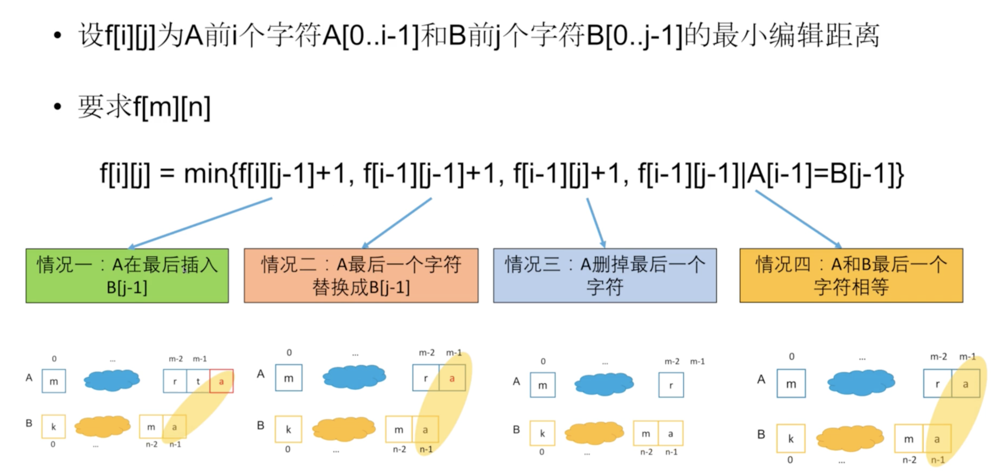

# 72. Edit Distance

> Given two words _word1_ and _word2_, find the minimum number of operations required to convert _word1_ to _word2_.
>
> You have the following 3 operations permitted on a word:
>
> 1. Insert a character
> 2. Delete a character
> 3. Replace a character
>
> **Example 1:**
>
> ```text
> Input: word1 = "horse", word2 = "ros"
> Output: 3
> Explanation: 
> horse -> rorse (replace 'h' with 'r')
> rorse -> rose (remove 'r')
> rose -> ros (remove 'e')
> ```
>
> **Example 2:**
>
> ```text
> Input: word1 = "intention", word2 = "execution"
> Output: 5
> Explanation: 
> intention -> inention (remove 't')
> inention -> enention (replace 'i' with 'e')
> enention -> exention (replace 'n' with 'x')
> exention -> exection (replace 'n' with 'c')
> exection -> execution (insert 'u')
> ```

## Solutions



### Approach \#1 DP, two dimensional array

```python
class Solution:
    def minDistance(self, word1: str, word2: str) -> int:
        l1 = len(word1)
        l2 = len(word2)
        
        dp = [[0 for _ in range(l2 + 1)] for _ in range(l1 + 1)]
        
        for i in range(l1 + 1):
            dp[i][0] = i
            
        for i in range(l2 + 1):
            dp[0][i] = i
            
        for i in range(1, l1 + 1):
            for j in range(1, l2 + 1):
                dp[i][j] = min(dp[i][j - 1] + 1, dp[i - 1][j] + 1, dp[i - 1][j - 1] + (word1[i - 1] != word2[j - 1]))
                
        return dp[l1][l2]
```

### Approach \#2 DP, one dimensional array

```python
class Solution:
    def minDistance(self, word1: str, word2: str) -> int:
        n = len(word1)
        m = len(word2) 
        dp = [0 for _ in range(m + 1)]    
        for i in range(m + 1):
            dp[i] = i   
        for i in range(1, n + 1):
            cur = [i] * (m + 1)
            for j in range(1, m + 1):
                cur[j] = min(cur[j - 1] + 1, dp[j] + 1, dp[j - 1] + (word1[i - 1] != word2[j - 1]))
            dp = cur[:]
        return dp[m]
```

### Approach \#3 General DP

```python
class Solution:
    def minDistance(self, word1: str, word2: str) -> int:
        if not word1 and not word2:
            return 0
        if not len(word1) or not len(word2):
            return len(word2) or len(word1)
        
        m = len(word1)
        n = len(word2)
        
        dp = [[0 for _ in range(n + 1)] for _ in range(m + 1)]
        
        for i in range(m + 1):
            for j in range(n + 1):
                if i == 0:
                    dp[i][j] = j
                elif j == 0:
                    dp[i][j] = i     
                elif word1[i - 1] == word2[j - 1]:
                    dp[i][j] = dp[i - 1][j - 1]
                else:
                    dp[i][j] = min(dp[i - 1][j - 1], dp[i][j - 1], dp[i - 1][j]) + 1
        
        return dp[-1][-1]
```

