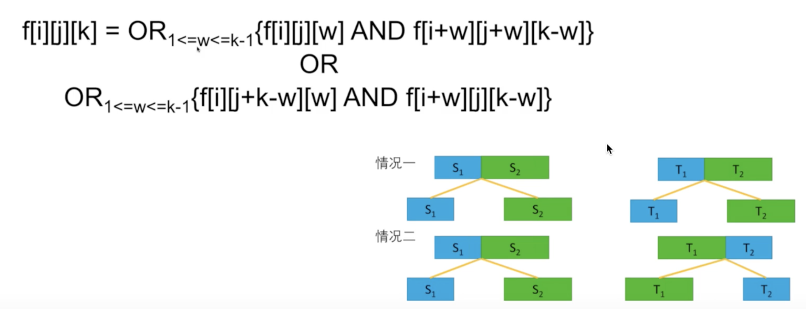

# 87. Scramble String

> Given a string _s1_, we may represent it as a binary tree by partitioning it to two non-empty substrings recursively.
>
> Below is one possible representation of _s1_ = `"great"`:
>
> ```text
>     great
>    /    \
>   gr    eat
>  / \    /  \
> g   r  e   at
>            / \
>           a   t
> ```
>
> To scramble the string, we may choose any non-leaf node and swap its two children.
>
> For example, if we choose the node `"gr"` and swap its two children, it produces a scrambled string `"rgeat"`.
>
> ```text
>     rgeat
>    /    \
>   rg    eat
>  / \    /  \
> r   g  e   at
>            / \
>           a   t
> ```
>
> We say that `"rgeat"` is a scrambled string of `"great"`.
>
> Similarly, if we continue to swap the children of nodes `"eat"` and `"at"`, it produces a scrambled string `"rgtae"`.
>
> ```text
>     rgtae
>    /    \
>   rg    tae
>  / \    /  \
> r   g  ta  e
>        / \
>       t   a
> ```
>
> We say that `"rgtae"` is a scrambled string of `"great"`.
>
> Given two strings _s1_ and _s2_ of the same length, determine if _s2_ is a scrambled string of _s1_.
>
> **Example 1:**
>
> ```text
> Input: s1 = "great", s2 = "rgeat"
> Output: true
> ```
>
> **Example 2:**
>
> ```text
> Input: s1 = "abcde", s2 = "caebd"
> Output: false
> ```

## Solutions

If target T was transformed from source S, then we can definitely deduced that at top level, S was divided into S1 and S2, T was divided into T1 and T2

In order to know if T was transformed from S, we need to figure out if T1 was transformed from S1 and T2 is transformed from S2, also, if T1 was transformed from S2 and T2 is transformed from S1. Therefore we reduce the level of complexity since S1, S2, T1, T2 are much shorter.

#### State

dp\[i\]\[j\]\[k\]\[h\] denotes if T\[k...h\] was transformed from S\[i...j\].

Noticed that all substrings are children of S and T, and they both have the same length, hence we can use start index and length to represent a substring. For example:

* The length of S1 is 5, starts with index 7,
* The length of T1 is 5, starts with index 0,
* Then we can use dp\[7\]\[0\]\[5\] = True/False to denote if S1 can be transformed into T1
* Since they both have the same length, hence dp\[7\]\[0\]\[5\]\[5\] has been calculated twice and have the same value for s1 and t1.

Now the equation can be further turned into:

dp\[i\]\[j\]\[k\] denotes if S1 can be transformed into T1

* S1 is a substring that starts from i pos of S, length of k
* T1 is a substring that starts from j pos of T, length of k

#### Transitional Equation



#### Initial State and Corner Cases

S\[i\] == T\[i\], dp\[i\]\[j\]\[1\] True, else dp\[i\]\[j\]\[1\] False

#### Complexity

Time, O\(n4\)

Space, O\(n3\)

### Approach \#1, DP

```python
class Solution:
    def isScramble(self, s1: str, s2: str) -> bool:
        n = len(s1)
        # f[i][j][k] 表示 s1[i : i + k] 攀爬能否得到 s2[j : j + k]
        dp = [[[False for _ in range(n + 1)] for _ in range(n)] for _ in range(n)]
        for i in range(n):
            for j in range(n):
                dp[i][j][1] = s1[i] == s2[j]
        for k in range(2, n + 1):
            for i in range(n - k + 1):
                for j in range(n - k + 1):
                    for t in range(1, k):
                        if dp[i][j][t] and dp[i + t][j + t][k - t]:
                            dp[i][j][k] = True
                            break
                        if dp[i][j + k - t][t] and dp[i + t][j][k - t]:
                            dp[i][j][k] = True
                            break
                            
        return dp[0][0][n]
```

### Approach \#2, DFS with pruning, Optimal Solution

```python
class Solution:
    def isScramble(self, s1, s2):
        if len(s1) != len(s2):
            return False
        if s1 == s2:
            return True
        if sorted(list(s1)) != sorted(list(s2)):
            return False
        length = len(s1)
        for i in range(1, length):
            if self.isScramble(s1[:i], s2[:i]) and self.isScramble(s1[i:], s2[i:]):
                return True
            if self.isScramble(s1[:i], s2[length-i:]) and self.isScramble(s1[i:], s2[:length-i]):
                return True
        return False
```

