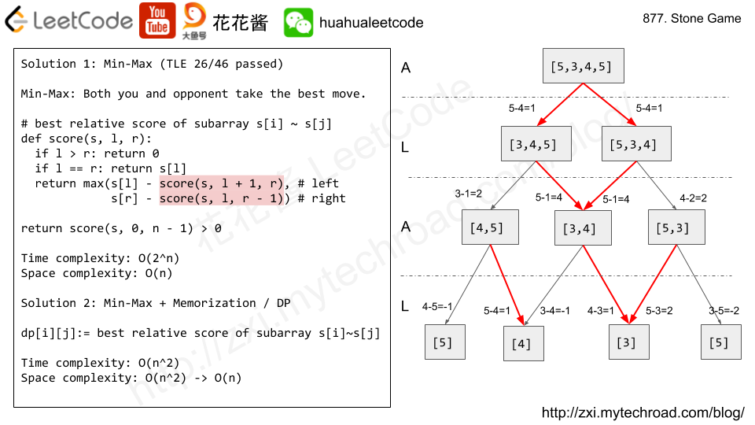

# 877. Stone Game

> Alex and Lee play a game with piles of stones.  There are an even number of piles **arranged in a row**, and each pile has a positive integer number of stones `piles[i]`.
>
> The objective of the game is to end with the most stones.  The total number of stones is odd, so there are no ties.
>
> Alex and Lee take turns, with Alex starting first.  Each turn, a player takes the entire pile of stones from either the beginning or the end of the row.  This continues until there are no more piles left, at which point the person with the most stones wins.
>
> Assuming Alex and Lee play optimally, return `True` if and only if Alex wins the game.

**Example 1:**

```text
Input: [5,3,4,5]Output: trueExplanation: Alex starts first, and can only take the first 5 or the last 5.Say he takes the first 5, so that the row becomes [3, 4, 5].If Lee takes 3, then the board is [4, 5], and Alex takes 5 to win with 10 points.If Lee takes the last 5, then the board is [3, 4], and Alex takes 4 to win with 9 points.This demonstrated that taking the first 5 was a winning move for Alex, so we return true.
```

**Note:**

1. `2 <= piles.length <= 500`
2. `piles.length` is even.
3. `1 <= piles[i] <= 500`
4. `sum(piles)` is odd.

## Solutions



### DFS + Memorizations

```python
class Solution:    def stoneGame(self, piles: List[int]) -> bool:        n = len(piles)        memo = [[float('-inf') for _ in range(n)] for _ in range(n)]                def dfs(s, l, r, m):            if l > r: return 0            if l == r: return piles[l]            if m[l][r] == float('-inf'):                m[l][r] = max(s[l] - dfs(s, l + 1, r, m), s[r] - dfs(s, l, r - 1, m))                            return m[l][r]                return dfs(piles, 0, n - 1, memo)
```

### DP

```python
class Solution:    def stoneGame(self, piles: List[int]) -> bool:        n = len(piles)        dp = piles        for l in range(2, n + 1):            for i in range(n - l + 1):                dp[i] = max(piles[i] - dp[i + 1], piles[i + l - 1] - dp[i])                        return dp[0] > 0
```

