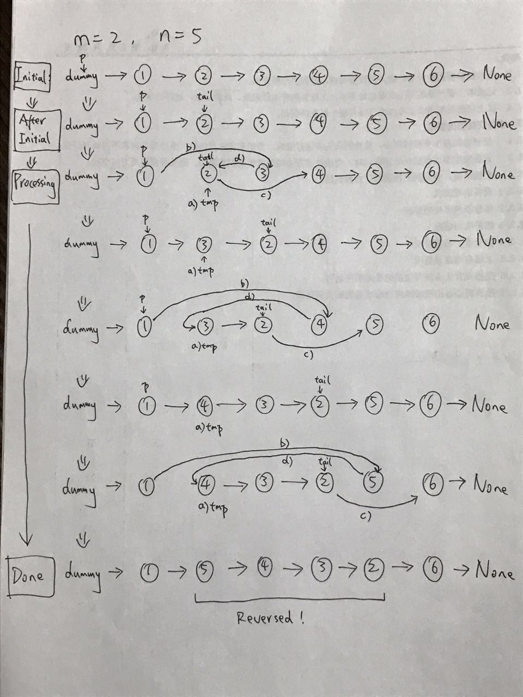

# 92. Reverse Linked List II

> Reverse a linked list from position _m_ to _n_. Do it in one-pass.
>
> **Note:** 1 ≤ _m_ ≤ _n_ ≤ length of list.
>
> **Example:**
>
> ```text
> Input: 1->2->3->4->5->NULL, m = 2, n = 4
> Output: 1->4->3->2->5->NULL
> ```

## Solutions

### Approach \#1



Time: O\(n\)

Space: O\(1\)

```python
class Solution:
    def reverseBetween(self, head: ListNode, m: int, n: int) -> ListNode:
        if not head:
            return None
        pre = dummy = ListNode(-1) # if it starts from the first node
        dummy.next = head
        for _ in range(m - 1):
            pre = pre.next 
        
        tail = pre.next 
        for _ in range(n - m):
            tmp = pre.next
            pre.next = tail.next
            tail.next = tail.next.next
            pre.next.next = tmp
        return dummy.next
```

